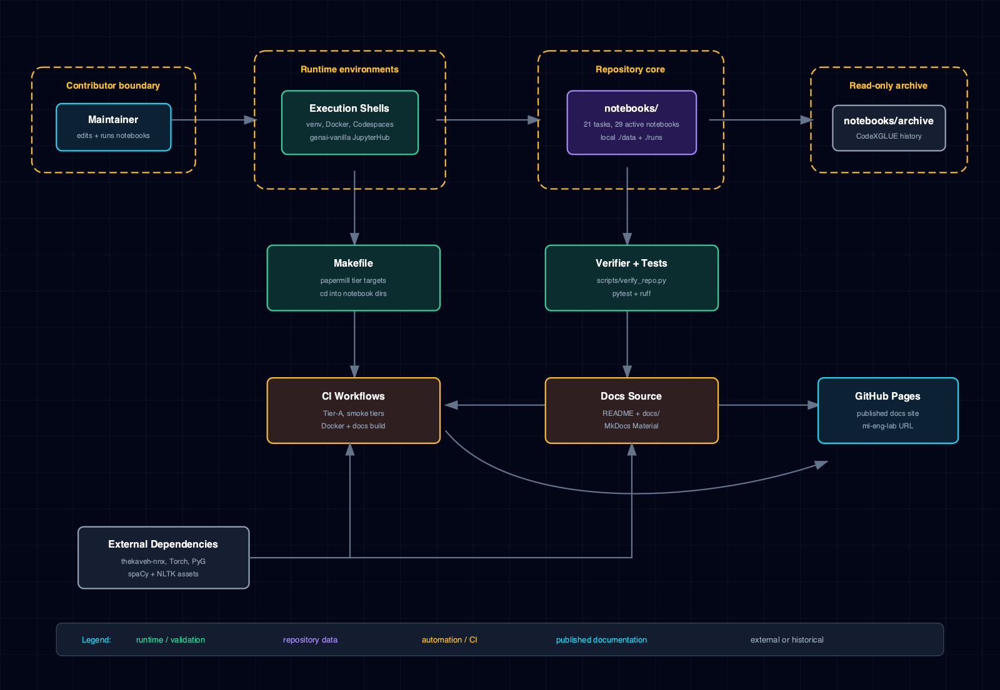

# 2.1 System & context view

This page describes the repository as a notebook-driven ML lab rather than as a deployable
service. The primary runtime objects are experiment directories under `notebooks/`, the notebook
execution tiers owned by the `Makefile`, the validation scripts under `scripts/`, and the three
documentation surfaces derived from the canonical `docs/` tree.

## 1. System architecture

The diagram below is rendered from the `system` diagram master declared in
`docs/manifest.yaml` (`docs/diagrams/ml-eng-lab-system.html`). The build pipeline rasterizes the
master to PNG for the repository and wiki surfaces and extracts the inline SVG for the site
surface, so all three surfaces embed the same geometry.

The diagram captures the repository context and primary components: the notebook task
directories, the shared `nnx` library consumed from PyPI, the validation and documentation
tooling, and the three documentation surfaces.

## 2. Three-surface documentation pipeline

The documentation system is the cleanest worked example of the lab's "canonical source +
derived surface" discipline. One source tree feeds three surfaces:

1. **Manifest.** `docs/manifest.yaml` declares the hierarchy, numbering, notebook specs, and
   diagram masters. It is the single source of truth for the page set — if a page is not in the
   manifest, it does not appear in the generated site or wiki.
2. **Site generation.** `scripts/docs/build_docs.py --site` reads the manifest, applies the
   per-surface transforms in `scripts/docs/transforms.py` (forbidden-link stripping,
   path rewriting, image-asset rewriting), and writes `generated/site/` plus a generated
   `mkdocs.yml`. MkDocs Material then builds the published site from `generated/site/`.
3. **Wiki generation.** `scripts/docs/build_docs.py --wiki` applies the wiki surface transform
   (slugified numbered filenames, `Home.md` / `_Sidebar.md` / `_Footer.md` convention) and writes
   `generated/wiki/`. `scripts/docs/push_wiki.py` mirrors it to the GitHub wiki using a
   dedicated deploy key.
4. **Diagram rendering.** `scripts/docs/render_diagrams.py` rasterizes each manifest-declared
   HTML master to SVG (for the site) and PNG (committed under `docs/diagrams/img/` for the
   repository and wiki).
5. **CI gate.** `scripts/docs/check_docs.py` enforces self-containment (no cross-surface HTTP
   links), completeness (every manifest entry has a source file), placeholder-freeness, and
   generation determinism. It exits non-zero on any error.

The transforms guarantee that a link written once in a canonical source resolves correctly on
every surface: relative canonical paths are rewritten to per-surface output paths, image
references are rewritten to the surface-appropriate asset format, and any link that would cross
a surface boundary (a site page linking to a GitHub source view, for example) is stripped to
bare text.

## 3. Runtime entry paths

A contributor opens the repository through one of four supported entry paths — a local venv, the
Docker image, GitHub Codespaces, or the vendored genai-vanilla JupyterHub stack — and runs or
edits an experiment under `notebooks/<task>/`. Notebook-local `./data/` and `./runs/` paths
resolve inside that experiment directory; `Makefile` targets execute notebooks by changing into
each notebook directory before invoking papermill, so the task-local path invariant holds.

`scripts/verify_repo.py`, pytest, ruff, and the CI workflows verify structure, documentation,
and public notebook surfaces before changes are merged.

## 4. Boundary decisions

- `notebooks/archive/` is preserved as read-only historical material and excluded from active
  notebook validation.
- `thekaveh-nnx[lm]==0.2.0` is consumed from PyPI; shared library changes land upstream in
  `thekaveh/NNx` before this repo bumps the pin.
- The quantization notebook is active but manual-only until the pinned Torch stack can satisfy
  `torchao>=0.17`.
- The canonical `docs/` tree is the only documentation source of truth; the generated site and
  wiki are never edited by hand.
