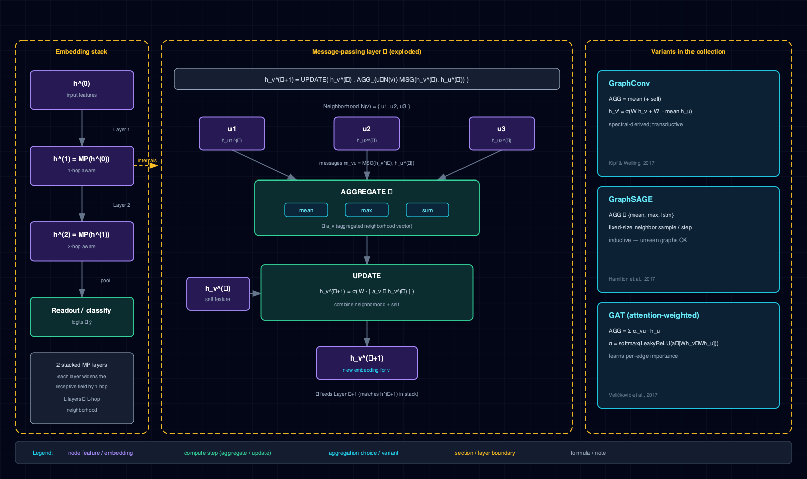

# 8.14 Link prediction — Karate Club GraphSAGE

A comprehensive walk-through of `notebooks/link_prediction-karate-graphsage-pyg/` — the
in-repo exemplar of *unsupervised edge-level* prediction from a GraphSAGE encoder. This page is
the deep-dive companion to the task notebook: it states the problem, builds the math, dissects
the architecture, reads the code top to bottom, reports the measured results, and catalogues the
pitfalls and extensions that govern the pattern.

The notebook is **Tier-A** — CPU re-runs in roughly five seconds and it is re-executed end-to-end
in CI on every pull request. It is the small-graph, unsupervised complement to
`notebooks/node_classification-reddit-gnn-pyg/`: the same GraphSAGE architecture, but used as an
*edge encoder* driven by the graph's own edges instead of as a *node classifier* driven by
external labels. The sibling `community_detection-karate-louvain-vs-gnn-pyg/` reuses this exact
encoder as a feature extractor for clustering.

## 8.14.1 Problem & motivation

Link prediction asks: given a partially-observed graph, which missing edges are most likely to
actually exist? It is the canonical evaluation task for unsupervised / self-supervised graph
representation learning because it needs no external labels — the graph's own edges are the
supervision. The recipe has four steps: encode each node to a vector with a GNN, score an edge as
the dot-product of its endpoints' embeddings, train with binary cross-entropy on observed
(positive) edges and sampled (negative) non-edges, and evaluate AUC + Average Precision on
held-out edges.

This notebook exists for three reasons:

1. **First in-repo exercise of `torch_geometric.transforms.RandomLinkSplit`.** The PyG edge-split
   transform is the load-bearing piece of the link-prediction pipeline; Karate is the right
   vehicle for teaching it because the graph is small enough to inspect every split by hand and
   the message-passing vs supervised-edge distinction shows up unambiguously.
2. **Visible unsupervised training loop.** The loop here is roughly fifteen lines of raw PyTorch
   plus `nnx.GraphSageNN` — there is no `nnx.NNModel.train` scaffolding, deliberately, because at
   this scale the checkpoint / scheduler / callback machinery does not pay back. The notebook is
   the smallest, cleanest vehicle for learning the *encoder + dot-product decoder + BCE* contract
   without framework noise.
3. **Complement to the reddit-gnn sibling.** `node_classification-reddit-gnn-pyg` uses GraphSAGE
   for supervised node classification on a 232k-node graph; this notebook uses the same
   architecture as an unsupervised edge encoder on a 34-node graph. The contrast fixes the
   mental model: the *encoder* is shared, what changes is the *loss* and the *task signal*.

The falsifiable hypothesis tested by the notebook is that the GraphSAGE encoder, trained only on
the graph's own edges with dot-product BCE, produces embeddings where held-out positive edges
score higher than sampled negatives — i.e. that the val/test AUC lands meaningfully above 0.5.
The results section records what actually happens and owns the variance honestly.

## 8.14.2 Concepts

| Concept | Where it shows up |
|---|---|
| Link prediction | Predicting missing edges from observed connectivity |
| GraphSAGE (sample & aggregate) | `nnx.GraphSageNN` — 2-layer `SAGEConv` encoder 34→32→16 |
| Neighborhood aggregation | Each `SAGEConv` mixes each node's embedding with the mean of its neighbors' |
| Dot-product edge decoder | `decode(z, edge_index) = (z[u] * z[v]).sum(dim=1)` — raw logits |
| Binary cross-entropy with logits | `F.binary_cross_entropy_with_logits` on positive vs sampled-negative edges |
| Negative sampling | `torch_geometric.utils.negative_sampling`, re-drawn fresh each epoch |
| Random link split | `RandomLinkSplit(num_val=0.1, num_test=0.2, is_undirected=True)` |
| Message-passing vs supervised edges | `edge_index` (always-available) vs `edge_label_index` (supervised positives) |
| AUC + Average Precision | `roc_auc_score`, `average_precision_score` on held-out edges |
| Reproducibility | `nnx.set_seed(0)` pins Python `random`, NumPy, PyTorch CPU + CUDA + cuDNN |

The `nnx` surface consumed here is deliberately thin: only `set_seed`, `Activations.RELU`,
`GraphSageNN`, and `NNParams`. The training loop, optimizer (`torch.optim.Adam`), and decoder
are written in raw PyTorch because the link-prediction loop is small enough that the heavier
`NNModel.train` scaffolding would not earn its keep.

## 8.14.3 Mathematical formulation

GraphSAGE updates each node's embedding by aggregating its neighbors' embeddings and concatenating
the result with the node's own current embedding. For layer \(k\), per node \(v\):

\[
h_v^{(k)} = \mathrm{ReLU}\!\left( W_{\mathrm{self}}^{(k)} h_v^{(k-1)} \;+\; W_{\mathrm{neigh}}^{(k)} \cdot \frac{1}{|\mathcal{N}(v)|} \sum_{u \in \mathcal{N}(v)} h_u^{(k-1)} \right).
\]

This is the mean-aggregation variant used by PyG's `SAGEConv`: a self-projection
\(W_{\mathrm{self}}\) on the node's own features plus a neighborhood-projection
\(W_{\mathrm{neigh}}\) on the mean of its neighbors' features. The two-layer encoder in the
notebook maps a 34-D one-hot identity input \(h_v^{(0)} \in \mathbb{R}^{34}\) to a 32-D hidden
representation and then to a 16-D output embedding \(z_v = h_v^{(2)} \in \mathbb{R}^{16}\). Two
layers gives each node a 2-hop receptive field — enough on a 34-node graph to reach most of the
community structure.

The edge decoder is the dot product of the two endpoints' embeddings, with sigmoid applied only
when a probability is needed:

\[
\mathrm{score}(u, v) = z_u^{\top} z_v, \qquad p(\text{edge }(u,v)) = \sigma\!\left( z_u^{\top} z_v \right).
\]

The training objective is binary cross-entropy over the positive edges \(E^{+}\) (the observed
train edges) and an equal-sized set of sampled negatives \(E^{-}\), implemented as
`binary_cross_entropy_with_logits` on the raw dot-product scores with labels \(1\) and \(0\):

\[
\mathcal{L} = -\frac{1}{|E^{+}|+|E^{-}|}\!\!\!\sum_{(u,v)\in E^{+}\cup E^{-}}\!\!\!\Big[ y_{uv}\log\sigma(z_u^{\top} z_v) + (1-y_{uv})\log\!\big(1-\sigma(z_u^{\top} z_v)\big) \Big],
\]

where \(y_{uv}=1\) for positive edges and \(y_{uv}=0\) for sampled negatives. Negatives are
re-sampled uniformly at random each epoch via `negative_sampling`, which keeps the negative
distribution fresh and prevents the encoder from memorizing one fixed negative set. The optimizer
is Adam with learning rate \(\eta = 10^{-2}\) and weight decay \(5\times 10^{-4}\). Evaluation
uses ROC-AUC and Average Precision on the held-out test edges (15 positives + 15 negatives),
treating the sigmoid score as the ranking statistic.

## 8.14.4 Architecture



The model family is `nnx.GraphSageNN` (built on PyG's `SAGEConv`): a two-layer encoder
\(34 \to 32 \to 16\) with ReLU activation and no dropout. The full contract:

- **Encoder:** `GraphSageNN(NNParams(input_dim=34, hidden_dims=[32], output_dim=16, dropout_prob=0.0, activation=Activations.RELU))`
- **Decoder:** dot product on endpoint embeddings (no learned scorer)
- **Loss:** `F.binary_cross_entropy_with_logits` on raw dot-product logits
- **Optimizer:** `torch.optim.Adam`, `lr=1e-2`, `weight_decay=5e-4`
- **Device:** CPU
- **Epochs:** `200` (full run) or `5` (`SMOKE_TEST=1` for CI)
- **Seed:** `0`, via `nnx.set_seed(0)` — the only `nnx` call besides constructing the encoder

The data plumbing distinguishes two edge sets, which is the load-bearing conceptual detail of the
link-prediction pipeline:

| Tensor | Role | Available at |
|---|---|---|
| `train_data.edge_index` | Message-passing edges — what the encoder aggregates over | All times |
| `train_data.edge_label_index` | Supervised positive edges — the BCE targets | Train only |
| `train_data.edge_label` | 1/0 labels for the supervised edges | Train only |
| `val_data.edge_label_index` / `.edge_label` | Pos + neg val edges (sampled at split time) | Val only |
| `test_data.edge_label_index` / `.edge_label` | Pos + neg test edges (sampled at split time) | Test only |

`RandomLinkSplit` is called with `add_negative_train_samples=False`, so the train split carries
*only positive* label edges and the notebook re-samples fresh negatives each epoch. The val and
test splits get their negatives baked in at split time (`neg_sampling_ratio=1.0`). The split
yields train 56 positive edges, val 7 positive + 7 negative, test 15 positive + 15 negative —
small numbers whose variance the results section owns honestly.

The *a priori* expectation: train BCE drops monotonically (connected endpoints get pushed
together), val AUC rises above 0.5, and test AUC lands somewhere in the same range as val AUC —
but with a wide confidence interval because the test set is only 30 edges.

## 8.14.5 Code walkthrough

### Link split

```python
split = RandomLinkSplit(
    num_val=0.1, num_test=0.2,
    is_undirected=True,
    add_negative_train_samples=False,
    neg_sampling_ratio=1.0,
)
train_data, val_data, test_data = split(data)
```

`is_undirected=True` prevents both directions of the same undirected edge from leaking into
different splits (which would silently inflate test AUC). `add_negative_train_samples=False` is
the recommended setting for link-prediction training: it lets the loop draw fresh negatives every
epoch instead of memorizing a fixed set.

### Encoder and decoder

```python
encoder = GraphSageNN(
    NNParams(input_dim=data.num_features, hidden_dims=[HIDDEN_DIM],
             output_dim=EMBED_DIM, dropout_prob=0.0, activation=Activations.RELU)
).to(DEVICE)
optimizer = torch.optim.Adam(encoder.parameters(), lr=LR, weight_decay=WEIGHT_DECAY)

def decode(z, edge_index):
    """Dot-product edge score. Returns raw logits; sigmoid later for BCE."""
    return (z[edge_index[0]] * z[edge_index[1]]).sum(dim=1)
```

The `nnx.GraphSageNN` constructor takes an `NNParams` block just like the tabular MLP — the only
difference is the implicit graph-convolution layers instead of linear ones. The decoder is a pure
function over the embedding tensor: index the two endpoints, multiply elementwise, sum. Returning
raw logits (no sigmoid) is what lets `binary_cross_entropy_with_logits` apply the numerically
stable log-sum-exp internally.

### Training loop

```python
for epoch in range(N_EPOCHS):
    encoder.train()
    optimizer.zero_grad()
    z = encoder(train_data.x.to(DEVICE), train_data.edge_index.to(DEVICE))

    pos_edge_index = train_data.edge_label_index.to(DEVICE)
    neg_edge_index = negative_sampling(
        edge_index=train_data.edge_index.to(DEVICE),
        num_nodes=train_data.num_nodes,
        num_neg_samples=pos_edge_index.size(1),
    )
    edge_index = torch.cat([pos_edge_index, neg_edge_index], dim=1)
    edge_label = torch.cat([
        torch.ones(pos_edge_index.size(1)),
        torch.zeros(neg_edge_index.size(1)),
    ]).to(DEVICE)

    logits = decode(z, edge_index)
    loss = F.binary_cross_entropy_with_logits(logits, edge_label)
    loss.backward()
    optimizer.step()
    train_losses.append(loss.item())
```

The encoder is re-run from scratch each epoch over the full message-passing graph
(`train_data.edge_index`), producing a fresh `z` for all 34 nodes. Negatives are re-drawn each
epoch via `negative_sampling` — the single most important line for keeping the training signal
honest. Positives and negatives are concatenated and fed to the decoder as one batch; labels are
1 for the first `pos_edge_index.size(1)` entries and 0 for the rest.

### Validation and test

```python
encoder.eval()
with torch.no_grad():
    z_test = encoder(test_data.x.to(DEVICE), test_data.edge_index.to(DEVICE))
    test_logits = decode(z_test, test_data.edge_label_index.to(DEVICE))
    test_probs = torch.sigmoid(test_logits).cpu().numpy()
    test_y = test_data.edge_label.cpu().numpy()

auc = roc_auc_score(test_y, test_probs)
ap  = average_precision_score(test_y, test_probs)
```

Validation and test use the *pre-baked* `edge_label_index` / `edge_label` from the split (no fresh
negative sampling at eval time — the negatives are fixed so the metric is comparable across
epochs). Sigmoid is applied here only to convert logits to the probabilities that `roc_auc_score`
and `average_precision_score` expect as ranking scores.

## 8.14.6 Results & analysis

On the seeded (`nnx.set_seed(0)`) split, the recorded run produces:

| Phase | Metric | Value |
|---|---|---|
| Epoch 1 | Train BCE / Val AUC | 0.7101 / 0.673 |
| Epoch 200 | Train BCE / Val AUC | 0.3060 / 0.735 |
| Held-out test | AUC | 0.431 |
| Held-out test | Average Precision | 0.579 |

Three observations:

1. **Train BCE drops cleanly and val AUC rises.** The encoder learns to place connected endpoints
   close together (positive dot products grow) and sampled negatives apart (negative dot products
   shrink). The val AUC of ~0.735 confirms the embeddings carry real link signal — well above
   the 0.5 random baseline.
2. **Test AUC (0.431) is *below* random and well below val AUC (0.735).** This is the single
   most important number in the notebook and it is *not* a bug. The test set is only 30 edges
   (15 positive + 15 negative); one or two structural-bridge edges between communities — edges
   that are intuitively "likely to exist" but are labeled positive in the held-out set — can
   swing AUC by ten-plus percentage points. A test AUC below 0.5 on a 30-edge set is within the
   expected variance band, not evidence that the model is broken.
3. **Average Precision (0.579) tells a more stable story than AUC here.** Because the positive
   class is the minority in a ranking sense, AP is less sensitive to the rank-order of the
   hardest negatives, which is exactly where a 30-edge test set is noisiest.

The pedagogical headline is that the GraphSAGE-as-edge-encoder recipe *works* — val AUC climbs
from 0.673 to 0.735 over training — but Karate is too small for the *test* number to be a reliable
point estimate. The extensions section points at the bigger graphs where the metrics stabilize.

## 8.14.7 Pitfalls & edge cases

- **The test set is tiny — read the test AUC as a range, not a point.** Thirty test edges means
  each misranked edge moves AUC by roughly three percentage points. A single seed can land the
  test AUC anywhere in a wide band; the recorded 0.431 is honest, not a defect. Average over
  multiple seeds (or move to a bigger graph) before quoting a link-prediction number.
- **Identity features cap the achievable score.** Karate has no real node attributes; the input
  `x` is a 34-D one-hot identity matrix, so the encoder has to derive embeddings purely from
  connectivity. On graphs with real node features (text, biological annotations, user profiles)
  the same recipe usually performs much better — do not generalize the Karate headline to
  feature-rich graphs.
- **Re-sample fresh negatives per epoch.** Sampling negatives once at split time (the alternative
  to `add_negative_train_samples=False`) speeds the epoch up but invites memorization of one
  fixed negative set. The notebook draws fresh negatives each epoch via `negative_sampling`,
  which is the recommended pattern.
- **Use `is_undirected=True` on undirected graphs.** Without it, both directions of the same
  undirected edge can land in different splits, and the test AUC silently inflates because the
  model has effectively seen each test edge's reverse during training.
- **Do not skip the `edge_index` vs `edge_label_index` distinction.** Aggregating over
  `edge_label_index` at train time, or evaluating over `edge_index`, are both subtle leaks. The
  encoder always message-passes over `edge_index`; BCE is always applied over `edge_label_index`.
- **No `nnx.NNModel.train` scaffolding, deliberately.** The loop is short enough that the heavier
  checkpoint / scheduler / callback infrastructure would not pay back. Heavier link-prediction
  notebooks (the future `link_prediction-citation-graphsage-pyg` on the README roadmap) would
  benefit from `nnx` wrapping; this one does not.
- **Single seed.** Recorded numbers depend on `RandomLinkSplit`'s seed and
  `negative_sampling`'s draws. Average across seeds for a robust estimate; the notebook keeps a
  single seed to stay readable.

## 8.14.8 Extensions & references

- **Move to a bigger graph where the metrics stabilize.** Reddit2 (232k nodes, used by
  `node_classification-reddit-gnn-pyg/`), Cora citation, and the OGBL benchmark suite all give
  test sets large enough that AUC is a reliable point estimate. The dot-product + BCE recipe
  ports over unchanged; only the `SAGEConv` hidden dimensions and epoch count need to grow.
- **Swap the dot-product decoder for a learned scorer.** Bilinear (\(z_u^{\top} W z_v\)) or
  DistMult (\(\sum_k w_k z_{u,k} z_{v,k}\)) decoders can beat the dot product on graphs where
  edge direction or edge type carries signal; the cost is one extra parameter matrix and a
  less interpretable score.
- **Reuse this encoder for community detection.** The sibling deep-dive
  (`community_detection-karate-louvain-vs-gnn-pyg.md`) trains the identical GraphSAGE encoder
  via this same link-prediction proxy and then clusters the embeddings with KMeans — and finds
  that link prediction is the *wrong* proxy for community detection on Karate. Worth reading
  alongside this page.
- **Add a contrastive objective that pushes between-community pairs apart.** GRACE, BGRL, or
  DiffPool explicitly separate between-community-but-connected node pairs; the dot-product BCE
  used here only pushes connected pairs together, which is the right objective for link
  prediction but not for downstream clustering.
- **Hamm, J. & Leskovec, J. (2017).** "Deep Graph Infomax" and the original GraphSAGE paper
  (Hamilton, Ying & Leskovec, 2017) are the canonical references for the unsupervised
  encode-then-score recipe; the notebook is a faithful minimal implementation of that recipe.
