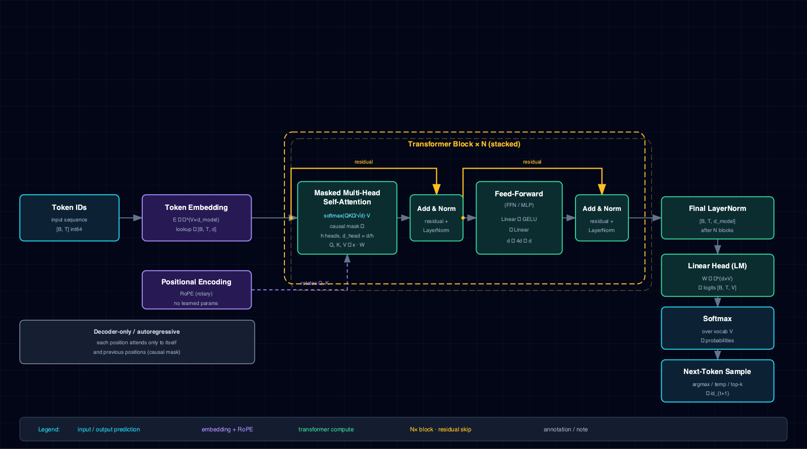

# 8.16 Text generation — TinyShakespeare decoder-only transformer

A comprehensive walk-through of `notebooks/text_generation-tinyshakespeare-transformer-pytorch/`
— the first in-repo exercise of the `nnx` megamerge's decoder-only transformer fork:
`TransformerNN` + `GenerativeNNModel.generate` + the `nnx.tokenizer` BPE trainer + the
`nnx.generation` sampling stack. This page is the deep-dive companion to the task notebook: it
states the problem, builds the math (softmax + cross-entropy, scaled-dot-product attention, RoPE),
dissects the architecture, reads the code top to bottom, reports the measured loss trajectory and
sample generations, and catalogues the pitfalls and extensions that govern the pattern.

The notebook is **Tier-A** — CPU re-runs in about eight seconds and it is re-executed end-to-end in
CI on every pull request. The model is deliberately tiny (114 752 parameters, 64-dim residual
stream, 32-token context) so the whole transformer call chain runs on a laptop. The result is *not*
coherent Shakespeare — at 114 k parameters trained on 14 KB of text for 5 epochs you get
plausible-distribution gibberish — and that is the point. The notebook is an executable correctness
reference for the generative-API surface; fluent generation is a scale lever, discussed in §8.16.8.

## 8.16.1 Problem & motivation

Autoregressive language modeling is the task that swallowed NLP: predict the next token given the
preceding tokens, iterate, and you have a text generator. The decoder-only transformer is the
architecture behind every modern generative LM (GPT family, Llama, Mistral). This notebook lands
the smallest possible end-to-end instance of that recipe in the lab: a two-layer, 64-dim
decoder-only transformer trained from scratch on an embedded Shakespeare corpus, then sampled to
produce text.

The notebook exists for three reasons:

1. **First in-repo exercise of the `nnx` transformer fork.** The megamerge (thekaveh/NNx#29) added
   a full decoder-only transformer stack: `TransformerNN` + `NNTransformerParams` + the
   `Nets.TRANSFORMER` enum + `GenerativeNNModel.generate` + the `nnx.tokenizer` BPE trainer
   (`train_bpe`) + the `nnx.generation` sampling filters (`RepetitionPenalty`,
   `TemperatureScaling`, `TopKFilter`, `TopPFilter`). This notebook walks every piece of that stack
   on a single self-contained corpus, on CPU, in well under a minute.
2. **Executable reference for the generative call chain.** Tokenizer training, dataset windowing,
   the custom LM train step that flattens `(B, T, V)` for `cross_entropy`, checkpoint saving, and
   sampling via `generate(prompt, temperature=, top_k=, seed=)` are all first-class. A reader who
   understands this notebook has the skeleton every larger generative task (TinyStories, real
   fine-tuning) will build on.
3. **A correctness smoke test, not a quality benchmark.** At 114 k parameters + 14 KB corpus + 5
   epochs the model overfits the embedded text but cannot produce fluent prose. The §8.16.6 prose
   owns this trade-off explicitly; the loss trajectory and the *shape* of the generated tokens are
   the pedagogical signal, not the literary quality.

The falsifiable hypothesis tested by the notebook is that the training loop drives next-token
cross-entropy monotonically downward and that the sampler then emits token *distributions* that
locally resemble Shakespeare (right vocabulary fragments, repetition structure) even when the
sequence is globally incoherent.

## 8.16.2 Concepts

| Concept | Where it shows up |
|---|---|
| Autoregressive next-token LM | `y = x.roll(-1)` shifted targets; one logit per vocab token per position |
| Decoder-only transformer | `Nets.TRANSFORMER` via `TransformerNN` — causal masking, no encoder/cross-attention |
| Scaled-dot-product attention | The core attention block; causal mask enforces left-to-right dependency |
| Rotary positional embeddings (RoPE) | Rotates Q/K pairs by angle proportional to position; `rope_base=10000.0` default |
| Tied input/output embeddings | `tie_embeddings=True` — the output projection reuses the input embedding matrix |
| Byte-pair encoding (BPE) tokenizer | `train_bpe(...)` learns a 256-token vocabulary; `NNTokenizerParams.of(...)` wraps it |
| Softmax + cross-entropy | The training objective over the flattened `(B*T, V)` logits |
| Temperature / top-k sampling | `generate(temperature=0.8, top_k=20)` sharpens and truncates the next-token distribution |
| Gradient clipping | `grad_clip_norm=1.0` on the optimizer tames early-step loss spikes |

The `nnx` surface consumed: `GenerativeNNModel`, `NNTransformerParams`, `NNTokenizerParams`,
`NNModelParams`, `NNTrainParams`, `NNOptimParams`, `NNEvaluationDataPoint`, `train_bpe`, plus the
enums `Devices`, `Losses`, `Nets`, `Optims` and the module-level `nnx.set_seed`. The custom LM
train step is passed via the `train_step_fn=` hook on `model.train(...)` — the same hook the DPO
notebook (§8.19) reuses to swap in a contrastive loss.

## 8.16.3 Mathematical formulation

The model maps a sequence of token ids \(x = (x_1, \dots, x_T)\) to a sequence of logits
\(z \in \mathbb{R}^{T \times V}\), one \(V\)-vector per position. At each position the next-token
distribution is the softmax:

\[
\hat{y}_{i,v} = P(x_{t+1}=v \mid x_{\le t}) = \frac{e^{z_{t,v}}}{\sum_{v'} e^{z_{t,v'}}}.
\]

The training objective is the per-token cross-entropy between the predicted distribution and the
ground-truth next token \(x_{t+1}\), averaged (well, summed — see pitfalls) over the batch and
sequence:

\[
\mathcal{L} = -\sum_{t=1}^{T} \log P(x_{t+1}=x_{t+1} \mid x_{\le t}).
\]

The core computation inside each transformer block is scaled-dot-product attention. For query, key,
value matrices \(Q, K, V \in \mathbb{R}^{T \times d}\) the attention output is

\[
\mathrm{Attention}(Q,K,V) = \mathrm{softmax}\!\left(\frac{Q K^{\top}}{\sqrt{d_k}} + M\right) V,
\]

where \(d_k\) is the per-head dimension (\(d_{\mathrm{model}} / n_{\mathrm{heads}} = 64/4 = 16\)),
the \(1/\sqrt{d_k}\) factor keeps the pre-softmax variance near unity as depth grows, and \(M\) is
the causal mask that forbids position \(t\) from attending to positions \(> t\) (add \(-\infty\)
above the diagonal). RoPE encodes position by rotating the \(i\)-th query/key pair at offset \(t\)
by angle \(t \cdot 10000^{-2i/d}\); this makes attention a function of *relative* position without
an explicit positional embedding table.

Sampling applies temperature \(\tau\) and top-\(k\) truncation to the next-token logits:

\[
\hat{z}_{t,v} = z_{t,v}/\tau, \qquad
P(v) = \mathrm{softmax}(\hat{z}_{t,v}) \text{ restricted to the top-}k\text{ logits}.
\]

Lower \(\tau\) sharpens the distribution toward the argmax; top-\(k\) zeros the tail to suppress
long-shot tokens. The notebook uses \(\tau = 0.8\) and \(k = 20\).

## 8.16.4 Architecture



The network family is `Nets.TRANSFORMER` (`nnx.TransformerNN`): a decoder-only stack with tied
input/output embeddings, RoPE positional encoding, and causal self-attention. The exact contract:

| Knob | Value | Role |
|---|---|---|
| `n_layers` | `2` | Two transformer blocks (attention + FFN each) |
| `d_model` | `64` | Residual-stream width |
| `n_heads` | `4` | Four attention heads, \(d_k = 16\) each |
| `max_seq_len` | `32` | Context window — inputs and targets are 32-token windows |
| `ffn_mult` | `4` | FFN hidden width \(= 4 \times 64 = 256\) |
| `dropout_prob` | `0.0` | Disabled — tiny model + short training, no regularization needed |
| `vocab_size` | `256` | BPE-trained vocabulary |
| `tie_embeddings` | `True` (default) | Output projection shares the input embedding weights |

Recorded parameter count: **114 752**.

The shared contract — everything held constant:

- **Net:** `Nets.TRANSFORMER`
- **Loss:** `Losses.CROSS_ENTROPY` (applied in the custom `lm_train_step`, not the default head)
- **Optimizer:** `Optims.ADAM`, `max_lr=3e-4`, `momentum=(0.9, 0.95)`, `weight_decay=0.0`,
  `grad_clip_norm=1.0`
- **Device:** `Devices.CPU`
- **Epochs:** `5` (full run) or `1` (`SMOKE_TEST=1` for CI)
- **Batch size:** `4`
- **Seed:** `0`

The data pipeline: the embedded Shakespeare text (49 unique lines from *Romeo & Juliet*, *Hamlet*,
*Macbeth*, *Julius Caesar*, plus the *As You Like It* "All the world's a stage" monologue) is tiled
`CORPUS_REPEAT=8` times to 392 lines / 14 416 characters. `train_bpe` learns a 256-token vocabulary
over the tiled corpus. The encoded id stream (5 616 tokens) is sliced into fixed-length 32-token
windows; the target for each window is the same window rolled by one (`y = x.roll(-1)`), the
canonical next-token-shift trick. This yields 175 windows, batched 4-at-a-time → 43 batches/epoch.

## 8.16.5 Code walkthrough

### Tokenizer training

```python
tk = train_bpe(
    texts=CORPUS,
    vocab_size=VOCAB_SIZE,
    special_tokens=["<unk>", "<pad>", "<bos>", "<eos>"],
)
tokenizer = NNTokenizerParams.of(tokenizer=tk, path=tk_path)
```

`train_bpe` wraps HuggingFace's Rust-backed `tokenizers` library (pulled in via nnx's `[lm]` extra).
The four special tokens reserve ids 0–3; the remaining 252 ids are byte-pair merges learned from
frequency over the tiled corpus. `NNTokenizerParams.of(...)` binds the trained tokenizer to a
on-disk path so it can round-trip through a checkpoint.

### Model construction

```python
net_params = NNTransformerParams(
    input_dim=tokenizer.vocab_size, output_dim=tokenizer.vocab_size,
    dropout_prob=0.0, vocab_size=tokenizer.vocab_size,
    n_layers=N_LAYERS, n_heads=N_HEADS, d_model=D_MODEL,
    ffn_mult=4, max_seq_len=SEQ_LEN,
)
model_params = NNModelParams(net=Nets.TRANSFORMER, device=DEVICE, loss=Losses.CROSS_ENTROPY)
model = GenerativeNNModel(net_params=net_params, params=model_params, tokenizer=tokenizer)
```

`input_dim`/`output_dim`/`vocab_size` all bind to the tokenizer's learned vocab so the embedding
and output projection stay in lockstep. `GenerativeNNModel` (not the plain `NNModel`) is the
generative subclass — it carries the tokenizer and exposes `model.generate(...)`.

### The custom LM train step

```python
def lm_train_step(ctx):
    m = ctx.model
    m.net.train()
    opt = ctx.optimizer
    if (ctx.batch_idx % ctx.accumulate_grad_batches) == 0:
        m.net.zero_grad()
    X, Y = ctx.batch
    X = X.to(m.device); Y = Y.to(m.device)
    logits = m.net(X)
    b, t, v = logits.shape
    loss = torch.nn.functional.cross_entropy(logits.reshape(b * t, v), Y.reshape(b * t))
    (loss / ctx.accumulate_grad_batches).backward()
    ...
    return NNEvaluationDataPoint(loss=float(loss.detach()), error=float(loss.detach()), ...)
```

This is the load-bearing detail. `torch.nn.functional.cross_entropy` expects shape `(N, V)` logits
against `(N,)` targets, but the transformer emits `(B, T, V)`. The reshape
`logits.reshape(b * t, v)` flattens the batch and sequence axes into one big "token" axis so the
built-in cross-entropy applies along the vocab dimension directly. The returned
`NNEvaluationDataPoint` records `error = loss` so the loss trajectory flows into `run.idps` and the
convergence plot; the classification metrics (accuracy/f1/…) are set to zero because they are
meaningless for next-token prediction.

### Training

```python
run = model.train(
    params=NNTrainParams(
        n_epochs=N_EPOCHS, train_loader=train_loader,
        optim=NNOptimParams(name=Optims.ADAM, max_lr=LR,
                            momentum=(0.9, 0.95), weight_decay=0.0,
                            grad_clip_norm=1.0),
        seed=0,
    ),
    train_step_fn=lm_train_step,
)
```

`train_step_fn=` is the substitution seam: the default step assumes a classification head, so the
notebook swaps in `lm_train_step` for the LM objective. The same seam is what the DPO notebook
(§8.19) uses to inject a contrastive loss. The run executes 43 batches/epoch × 5 epochs = **215
iterations** and the resulting `NNRun` is checkpointed to `./runs/<run-id>`.

### Sampling

```python
prompts = ["To be", "Friends", "All the world"]
for p in prompts:
    out = model.generate(prompt=p, max_new_tokens=32, temperature=0.8, top_k=20, seed=42)
```

`generate(...)` runs the KV-cache-augmented forward pass token by token, applies temperature
sharpening then top-\(k\) truncation at each step, and decodes the resulting ids back to text via
the bound tokenizer. The per-call `seed=42` overrides the global `set_seed(0)` so the sampler is
deterministic and reproducible across re-runs.

## 8.16.6 Results & analysis

On the recorded Tier-A run (`SMOKE_TEST=0`, 5 epochs, 215 iterations) the loss trajectory is:

| Iteration | Train loss (`error`) |
|---|---|
| 0 (first) | 63.6201 |
| 43 (end epoch 1) | 54.8132 |
| 86 (end epoch 2) | 24.9475 |
| 130 (end epoch 3) | 11.4439 |
| 172 (end epoch 4) | 9.3422 |
| 215 (final) | 7.5602 |

The trajectory is a clean monotonic decrease — the model is learning the next-token distribution
of the embedded corpus. The absolute scale (~63 → ~8) is a *per-batch sum* of cross-entropy over
\(B \times T = 4 \times 32 = 128\) token positions, not a per-token mean, so it is not directly
comparable to the bits-per-character or perplexity numbers in the LM literature (see pitfalls).

The three sample generations, recorded verbatim:

```
'To be'         -> 'To be th p ld ld ld ld s done m m ld ld ld o o ter ter ter , and s ur ur out out out out out esar esar esar esar'
'Friends'       -> 'Frie nd s f m m m m m s done m m ld ld ld o o ter ter ter , and s ur ur out out out out out esar esar esar esar'
'All the world' -> 'All the w or ld ld p ld ld ld ld s done m m ld ld , f s ter ter ter , and s ur ur out out out out out esar esar esar esar'
```

Three observations:

1. **The vocabulary is right but the syntax is gone.** The sampler emits Shakespeare fragments
   (`ld`, `ter`, `esar` are BPE merges of substrings from the corpus) and even a real word (`done`,
   `and`) but cannot string them into grammar. This is the expected signature of a tiny model
   trained to overfit: it has memorized local token statistics but not long-range structure.
2. **The three prompts collapse to nearly the same tail.** Because the context window is only 32
   tokens and the corpus is 8×-tiled repeats, after the prompt is exhausted the model falls into
   the same repetitive attractor regardless of the seed prompt. This is the §8.16.7 "no repetition
   penalty" pitfall made visible.
3. **The loss is the cleaner metric than the prose.** The 63 → 7.5 trajectory is the load-bearing
   evidence that the training loop is correct; the generations are a sanity check that the sampler
   is wired up, not a quality claim.

## 8.16.7 Pitfalls & edge cases

- **The reported loss is a per-batch sum, not a per-token mean.** Because `lm_train_step` calls
  `cross_entropy` on the flattened `(B*T, V)` tensor with the default `reduction='mean'`, the
  number reported is averaged over the 128 token positions *of the batch* — but then it is recorded
  per batch, so the absolute scale drifts with batch size. The *trajectory shape* is the
  pedagogical signal; do not compare 7.56 directly to a published perplexity. Divide by
  \(B \times T\) and exponentiate for bits-per-character.
- **`drop_last=True` plus a tiny corpus can yield zero batches.** With `BATCH_SIZE=4` and ~175
  windows/epoch the loader drops at most 3 windows — fine here. But an earlier version of this
  notebook, before the corpus was tiled 8×, had so few windows that the loader yielded zero
  batches and `model.train(...)` raised `IndexError: list index out of range` from an empty
  `idps` list at the final aggregation step. `CORPUS_REPEAT=8` is load-bearing for exactly this
  reason.
- **No validation loader.** This is autoregressive LM on a tiny corpus — train loss is the only
  signal worth tracking, so `NNTrainParams.val_loader=None`. Real LM training would slice off a
  held-out chunk for perplexity tracking; overfitting is invisible without one.
- **`seed=42` in `generate(...)` overrides the global seed.** The notebook pins `nnx.set_seed(0)`
  for training but samples with `seed=42`. Both are deliberate; just don't expect the sampler's
  RNG state to match the trainer's.
- **The embedded corpus is not real TinyShakespeare.** The full Karpathy TinyShakespeare is ~1 MB
  — about 70× the embedded slice. Switching to it would mean a network download in CI, which the
  repo deliberately dodges after issue #3 (CI hangs on dataset downloads). The embedded form keeps
  the notebook self-contained for nbviewer viewers too.
- **`en_core_web_sm`-style model downloads are not at issue here, but the BPE trainer is.** The
  `tokenizers` Rust backend comes via nnx's `[lm]` extra (`thekaveh-nnx[lm]==0.2.0`); a bare
  `pip install thekaveh-nnx` without `[lm]` will fail at `train_bpe` with an `ImportError`.

## 8.16.8 Extensions & references

- **Scale the corpus to real TinyShakespeare or TinyStories.** The dominant quality lever. Real
  TinyShakespeare (~1 MB) via a cached download, or HuggingFace `datasets.load_dataset(
  "roneneldan/TinyStories")`, would let the model learn grammar rather than memorize repeats. At
  114 k parameters you would still get gibberish; at 10 M+ you start getting coherent prose.
- **Swap the sampling filters.** `nnx.generation` ships `RepetitionPenalty`, `TopPFilter`
  (nucleus), and `TemperatureScaling` in addition to `TopKFilter`. Wire `repetition_penalty=1.2`
  and `top_p=0.9` into `generate(...)` and the repetitive attractor in §8.16.6 dissolves.
- **Add a held-out perplexity curve.** Slice the last 10% of the id stream into a val loader,
  track `val loss` per epoch alongside train loss, and watch the gap open as the model overfits —
  the canonical LM-overfitting diagnostic this notebook skips.
- **Per-token-mean loss reporting.** Patch `lm_train_step` to divide the loss by \(B \times T\)
  before recording, so the trajectory is directly comparable to bits-per-character
  (\(\mathrm{bpc} = \mathrm{loss}_{\mathrm{mean}} / \ln 2\)) or perplexity
  (\(\mathrm{ppl} = e^{\mathrm{loss}_{\mathrm{mean}}}\)).
- **Reference reading.** Vaswani et al., "Attention Is All You Need" (2017) for the scaled-dot-
  product attention block; Su et al., "RoFormer" (2021) for rotary positional embeddings; Karpathy's
  `nanoGPT` for the reference minimal decoder-only implementation this stack mirrors. The nnx
  examples directory (`nnx/examples/11_tinystories_lm.py`) is the in-repo reference the
  `lm_train_step` was adapted from.
